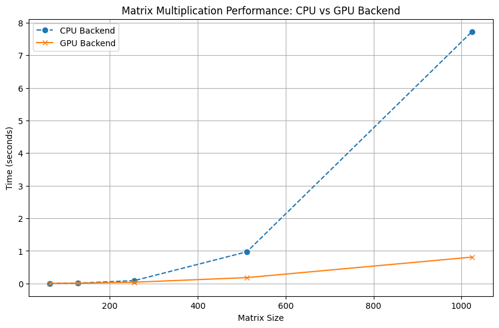

# MiniTorch Module 3


- Docs: https://minitorch.github.io/

- Overview: https://minitorch.github.io/module3.html

You will need to modify `tensor_functions.py` slightly in this assignment.

- Tests:

```
python run_tests.py
```

- Note:

Several of the tests for this assignment will only run if you are on a GPU machine and will not
run on github's test infrastructure. Please follow the instructions to setup up a colab machine
to run these tests.

This assignment requires the following files from the previous assignments. You can get these by running

```bash
python sync_previous_module.py previous-module-dir current-module-dir
```

The files that will be synced are:

        minitorch/tensor_data.py minitorch/tensor_functions.py minitorch/tensor_ops.py minitorch/operators.py minitorch/scalar.py minitorch/scalar_functions.py minitorch/module.py minitorch/autodiff.py minitorch/module.py project/run_manual.py project/run_scalar.py project/run_tensor.py minitorch/operators.py minitorch/module.py minitorch/autodiff.py minitorch/tensor.py minitorch/datasets.py minitorch/testing.py minitorch/optim.py

## Parallel diagnostic output

````
MAP

================================================================================
 Parallel Accelerator Optimizing:  Function tensor_map.<locals>._map,
/Users/taehyeon/repositories/mod3-taehyeon4/minitorch/fast_ops.py (163)
================================================================================


Parallel loop listing for  Function tensor_map.<locals>._map, /Users/taehyeon/repositories/mod3-taehyeon4/minitorch/fast_ops.py (163)
-----------------------------------------------------------------------------|loop #ID
    def _map(                                                                |
        out: Storage,                                                        |
        out_shape: Shape,                                                    |
        out_strides: Strides,                                                |
        in_storage: Storage,                                                 |
        in_shape: Shape,                                                     |
        in_strides: Strides,                                                 |
    ) -> None:                                                               |
        # Check if tensors are stride-aligned                                |
        is_aligned = (                                                       |
            len(out_shape) == len(in_shape)                                  |
            and len(out_strides) == len(in_strides)                          |
            and (out_shape == in_shape).all()--------------------------------| #0
            and (out_strides == in_strides).all()----------------------------| #1
        )                                                                    |
                                                                             |
        if is_aligned:                                                       |
            for i in prange(len(out)):---------------------------------------| #2
                out[i] = fn(in_storage[i])                                   |
        else:                                                                |
            for i in prange(len(out)):---------------------------------------| #3
                out_index = np.empty(MAX_DIMS, dtype=np.int32)               |
                in_index = np.empty(MAX_DIMS, dtype=np.int32)                |
                to_index(i, out_shape, out_index)                            |
                broadcast_index(out_index, out_shape, in_shape, in_index)    |
                                                                             |
                in_pos = index_to_position(in_index, in_strides)             |
                out_pos = index_to_position(out_index, out_strides)          |
                out[out_pos] = fn(in_storage[in_pos])                        |
--------------------------------- Fusing loops ---------------------------------
Attempting fusion of parallel loops (combines loops with similar properties)...
Following the attempted fusion of parallel for-loops there are 4 parallel for-
loop(s) (originating from loops labelled: #0, #1, #2, #3).
--------------------------------------------------------------------------------
----------------------------- Before Optimisation ------------------------------
--------------------------------------------------------------------------------
------------------------------ After Optimisation ------------------------------
Parallel structure is already optimal.
--------------------------------------------------------------------------------
--------------------------------------------------------------------------------

---------------------------Loop invariant code motion---------------------------
Allocation hoisting:
The memory allocation derived from the instruction at
/Users/taehyeon/repositories/mod3-taehyeon4/minitorch/fast_ops.py (184) is
hoisted out of the parallel loop labelled #3 (it will be performed before the
loop is executed and reused inside the loop):
   Allocation:: out_index = np.empty(MAX_DIMS, dtype=np.int32)
    - numpy.empty() is used for the allocation.
The memory allocation derived from the instruction at
/Users/taehyeon/repositories/mod3-taehyeon4/minitorch/fast_ops.py (185) is
hoisted out of the parallel loop labelled #3 (it will be performed before the
loop is executed and reused inside the loop):
   Allocation:: in_index = np.empty(MAX_DIMS, dtype=np.int32)
    - numpy.empty() is used for the allocation.
None
ZIP

================================================================================
 Parallel Accelerator Optimizing:  Function tensor_zip.<locals>._zip,
/Users/taehyeon/repositories/mod3-taehyeon4/minitorch/fast_ops.py (219)
================================================================================


Parallel loop listing for  Function tensor_zip.<locals>._zip, /Users/taehyeon/repositories/mod3-taehyeon4/minitorch/fast_ops.py (219)
---------------------------------------------------------------------------|loop #ID
    def _zip(                                                              |
        out: Storage,                                                      |
        out_shape: Shape,                                                  |
        out_strides: Strides,                                              |
        a_storage: Storage,                                                |
        a_shape: Shape,                                                    |
        a_strides: Strides,                                                |
        b_storage: Storage,                                                |
        b_shape: Shape,                                                    |
        b_strides: Strides,                                                |
    ) -> None:                                                             |
        # Check if tensors are stride-aligned                              |
        is_aligned = (                                                     |
            len(out_strides) == len(a_strides)                             |
            and len(out_shape) == len(a_shape)                             |
            and len(a_strides) == len(b_strides)                           |
            and len(b_shape) == len(a_shape)                               |
            and (out_strides == a_strides).all()---------------------------| #4
            and (a_strides == b_strides).all()-----------------------------| #5
            and (out_shape == a_shape).all()-------------------------------| #6
            and (a_shape == b_shape).all()---------------------------------| #7
        )                                                                  |
                                                                           |
        if is_aligned:                                                     |
            for i in prange(len(out)):-------------------------------------| #8
                out[i] = fn(a_storage[i], b_storage[i])                    |
        else:                                                              |
            for i in prange(len(out)):-------------------------------------| #9
                # Create index buffers                                     |
                out_index = np.empty(MAX_DIMS, dtype=np.int32)             |
                a_index = np.empty(MAX_DIMS, dtype=np.int32)               |
                b_index = np.empty(MAX_DIMS, dtype=np.int32)               |
                                                                           |
                to_index(i, out_shape, out_index)                          |
                                                                           |
                # Handle broadcasting                                      |
                broadcast_index(out_index, out_shape, a_shape, a_index)    |
                broadcast_index(out_index, out_shape, b_shape, b_index)    |
                                                                           |
                # Calculate positions                                      |
                a_pos = index_to_position(a_index, a_strides)              |
                b_pos = index_to_position(b_index, b_strides)              |
                out_pos = index_to_position(out_index, out_strides)        |
                                                                           |
                out[out_pos] = fn(a_storage[a_pos], b_storage[b_pos])      |
--------------------------------- Fusing loops ---------------------------------
Attempting fusion of parallel loops (combines loops with similar properties)...
Following the attempted fusion of parallel for-loops there are 6 parallel for-
loop(s) (originating from loops labelled: #4, #5, #6, #7, #8, #9).
--------------------------------------------------------------------------------
----------------------------- Before Optimisation ------------------------------
--------------------------------------------------------------------------------
------------------------------ After Optimisation ------------------------------
Parallel structure is already optimal.
--------------------------------------------------------------------------------
--------------------------------------------------------------------------------

---------------------------Loop invariant code motion---------------------------
Allocation hoisting:
The memory allocation derived from the instruction at
/Users/taehyeon/repositories/mod3-taehyeon4/minitorch/fast_ops.py (248) is
hoisted out of the parallel loop labelled #9 (it will be performed before the
loop is executed and reused inside the loop):
   Allocation:: out_index = np.empty(MAX_DIMS, dtype=np.int32)
    - numpy.empty() is used for the allocation.
The memory allocation derived from the instruction at
/Users/taehyeon/repositories/mod3-taehyeon4/minitorch/fast_ops.py (249) is
hoisted out of the parallel loop labelled #9 (it will be performed before the
loop is executed and reused inside the loop):
   Allocation:: a_index = np.empty(MAX_DIMS, dtype=np.int32)
    - numpy.empty() is used for the allocation.
The memory allocation derived from the instruction at
/Users/taehyeon/repositories/mod3-taehyeon4/minitorch/fast_ops.py (250) is
hoisted out of the parallel loop labelled #9 (it will be performed before the
loop is executed and reused inside the loop):
   Allocation:: b_index = np.empty(MAX_DIMS, dtype=np.int32)
    - numpy.empty() is used for the allocation.
None
REDUCE

================================================================================
 Parallel Accelerator Optimizing:  Function tensor_reduce.<locals>._reduce,
/Users/taehyeon/repositories/mod3-taehyeon4/minitorch/fast_ops.py (289)
================================================================================


Parallel loop listing for  Function tensor_reduce.<locals>._reduce, /Users/taehyeon/repositories/mod3-taehyeon4/minitorch/fast_ops.py (289)
-------------------------------------------------------------------|loop #ID
    def _reduce(                                                   |
        out: Storage,                                              |
        out_shape: Shape,                                          |
        out_strides: Strides,                                      |
        a_storage: Storage,                                        |
        a_shape: Shape,                                            |
        a_strides: Strides,                                        |
        reduce_dim: int,                                           |
    ) -> None:                                                     |
        for i in prange(len(out)):---------------------------------| #10
            out_index = np.empty(MAX_DIMS, dtype=np.int32)         |
            reduce_size = a_shape[reduce_dim]                      |
            to_index(i, out_shape, out_index)                      |
            out_pos = index_to_position(out_index, out_strides)    |
                                                                   |
            reduce_stride = a_strides[reduce_dim]                  |
            base_pos = index_to_position(out_index, a_strides)     |
            acc = out[out_pos]                                     |
                                                                   |
            for j in range(reduce_size):                           |
                a_pos = base_pos + j * reduce_stride               |
                acc = fn(acc, float(a_storage[a_pos]))             |
                                                                   |
            out[out_pos] = acc                                     |
--------------------------------- Fusing loops ---------------------------------
Attempting fusion of parallel loops (combines loops with similar properties)...
Following the attempted fusion of parallel for-loops there are 1 parallel for-
loop(s) (originating from loops labelled: #10).
--------------------------------------------------------------------------------
----------------------------- Before Optimisation ------------------------------
--------------------------------------------------------------------------------
------------------------------ After Optimisation ------------------------------
Parallel structure is already optimal.
--------------------------------------------------------------------------------
--------------------------------------------------------------------------------

---------------------------Loop invariant code motion---------------------------
Allocation hoisting:
The memory allocation derived from the instruction at
/Users/taehyeon/repositories/mod3-taehyeon4/minitorch/fast_ops.py (299) is
hoisted out of the parallel loop labelled #10 (it will be performed before the
loop is executed and reused inside the loop):
   Allocation:: out_index = np.empty(MAX_DIMS, dtype=np.int32)
    - numpy.empty() is used for the allocation.
None
MATRIX MULTIPLY

================================================================================
 Parallel Accelerator Optimizing:  Function _tensor_matrix_multiply,
/Users/taehyeon/repositories/mod3-taehyeon4/minitorch/fast_ops.py (317)
================================================================================


Parallel loop listing for  Function _tensor_matrix_multiply, /Users/taehyeon/repositories/mod3-taehyeon4/minitorch/fast_ops.py (317)
--------------------------------------------------------------------------------|loop #ID
def _tensor_matrix_multiply(                                                    |
    out: Storage,                                                               |
    out_shape: Shape,                                                           |
    out_strides: Strides,                                                       |
    a_storage: Storage,                                                         |
    a_shape: Shape,                                                             |
    a_strides: Strides,                                                         |
    b_storage: Storage,                                                         |
    b_shape: Shape,                                                             |
    b_strides: Strides,                                                         |
) -> None:                                                                      |
    """NUMBA tensor matrix multiply function.                                   |
                                                                                |
    Should work for any tensor shapes that broadcast as long as                 |
                                                                                |
    ```                                                                         |
    assert a_shape[-1] == b_shape[-2]                                           |
    ```                                                                         |
                                                                                |
    Optimizations:                                                              |
                                                                                |
    * Outer loop in parallel                                                    |
    * No index buffers or function calls                                        |
    * Inner loop should have no global writes, 1 multiply.                      |
                                                                                |
                                                                                |
    Args:                                                                       |
    ----                                                                        |
        out (Storage): storage for `out` tensor                                 |
        out_shape (Shape): shape for `out` tensor                               |
        out_strides (Strides): strides for `out` tensor                         |
        a_storage (Storage): storage for `a` tensor                             |
        a_shape (Shape): shape for `a` tensor                                   |
        a_strides (Strides): strides for `a` tensor                             |
        b_storage (Storage): storage for `b` tensor                             |
        b_shape (Shape): shape for `b` tensor                                   |
        b_strides (Strides): strides for `b` tensor                             |
                                                                                |
    Returns:                                                                    |
    -------                                                                     |
        None : Fills in `out`                                                   |
                                                                                |
    """                                                                         |
    a_batch_stride = a_strides[0] if a_shape[0] > 1 else 0                      |
    b_batch_stride = b_strides[0] if b_shape[0] > 1 else 0                      |
    out_batch_stride = out_strides[0] if out_shape[0] > 1 else 0                |
                                                                                |
    for batch in prange(out_shape[0]):------------------------------------------| #11
        a_batch_idx = batch * a_batch_stride                                    |
        b_batch_idx = batch * b_batch_stride                                    |
        out_batch_idx = batch * out_batch_stride                                |
                                                                                |
        for r in range(out_shape[-2]):                                          |
            a_r_stride = r * a_strides[-2]                                      |
            out_r_stride = r * out_strides[-2]                                  |
            for c in range(out_shape[-1]):                                      |
                b_c_stride = c * b_strides[-1]                                  |
                out_idx = out_batch_idx + out_r_stride + c * out_strides[-1]    |
                acc = 0.0                                                       |
                for k in range(a_shape[-1]):                                    |
                    a_idx = a_batch_idx + a_r_stride + k * a_strides[-1]        |
                    b_idx = b_batch_idx + k * b_strides[-2] + b_c_stride        |
                    acc += a_storage[a_idx] * b_storage[b_idx]                  |
                out[out_idx] = acc                                              |
--------------------------------- Fusing loops ---------------------------------
Attempting fusion of parallel loops (combines loops with similar properties)...
Following the attempted fusion of parallel for-loops there are 1 parallel for-
loop(s) (originating from loops labelled: #11).
--------------------------------------------------------------------------------
----------------------------- Before Optimisation ------------------------------
--------------------------------------------------------------------------------
------------------------------ After Optimisation ------------------------------
Parallel structure is already optimal.
--------------------------------------------------------------------------------
--------------------------------------------------------------------------------

---------------------------Loop invariant code motion---------------------------
Allocation hoisting:
No allocation hoisting found
None
````

## Task 3.3 and 3.4 results from Colab

`@cd $DIR; pytest -v -m "task3_3 or task3_4"`

```
collected 117 items / 53 deselected / 64 selected

tests/test_tensor_general.py::test_create[cuda] PASSED                                       [  1%]
tests/test_tensor_general.py::test_one_args[cuda-fn0] PASSED                                 [  3%]
tests/test_tensor_general.py::test_one_args[cuda-fn1] PASSED                                 [  4%]
tests/test_tensor_general.py::test_one_args[cuda-fn2] PASSED                                 [  6%]
tests/test_tensor_general.py::test_one_args[cuda-fn3] PASSED                                 [  7%]
tests/test_tensor_general.py::test_one_args[cuda-fn4] PASSED                                 [  9%]
tests/test_tensor_general.py::test_one_args[cuda-fn5] PASSED                                 [ 10%]
tests/test_tensor_general.py::test_one_args[cuda-fn6] PASSED                                 [ 12%]
tests/test_tensor_general.py::test_one_args[cuda-fn7] PASSED                                 [ 14%]
tests/test_tensor_general.py::test_one_args[cuda-fn8] PASSED                                 [ 15%]
tests/test_tensor_general.py::test_one_args[cuda-fn9] PASSED                                 [ 17%]
tests/test_tensor_general.py::test_one_args[cuda-fn10] PASSED                                [ 18%]
tests/test_tensor_general.py::test_one_args[cuda-fn11] PASSED                                [ 20%]
tests/test_tensor_general.py::test_one_args[cuda-fn12] PASSED                                [ 21%]
tests/test_tensor_general.py::test_one_args[cuda-fn13] PASSED                                [ 23%]
tests/test_tensor_general.py::test_two_args[cuda-fn0] PASSED                                 [ 25%]
tests/test_tensor_general.py::test_two_args[cuda-fn1] PASSED                                 [ 26%]
tests/test_tensor_general.py::test_two_args[cuda-fn2] PASSED                                 [ 28%]
tests/test_tensor_general.py::test_two_args[cuda-fn3] PASSED                                 [ 29%]
tests/test_tensor_general.py::test_two_args[cuda-fn4] PASSED                                 [ 31%]
tests/test_tensor_general.py::test_two_args[cuda-fn5] PASSED                                 [ 32%]
tests/test_tensor_general.py::test_one_derivative[cuda-fn0] PASSED                           [ 34%]
tests/test_tensor_general.py::test_one_derivative[cuda-fn1] PASSED                           [ 35%]
tests/test_tensor_general.py::test_one_derivative[cuda-fn2] PASSED                           [ 37%]
tests/test_tensor_general.py::test_one_derivative[cuda-fn3] PASSED                           [ 39%]
tests/test_tensor_general.py::test_one_derivative[cuda-fn4] PASSED                           [ 40%]
tests/test_tensor_general.py::test_one_derivative[cuda-fn5] PASSED                           [ 42%]
tests/test_tensor_general.py::test_one_derivative[cuda-fn6] PASSED                           [ 43%]
tests/test_tensor_general.py::test_one_derivative[cuda-fn7] PASSED                           [ 45%]
tests/test_tensor_general.py::test_one_derivative[cuda-fn8] PASSED                           [ 46%]
tests/test_tensor_general.py::test_one_derivative[cuda-fn9] PASSED                           [ 48%]
tests/test_tensor_general.py::test_one_derivative[cuda-fn10] PASSED                          [ 50%]
tests/test_tensor_general.py::test_one_derivative[cuda-fn11] PASSED                          [ 51%]
tests/test_tensor_general.py::test_one_derivative[cuda-fn12] PASSED                          [ 53%]
tests/test_tensor_general.py::test_one_derivative[cuda-fn13] PASSED                          [ 54%]
tests/test_tensor_general.py::test_two_grad[cuda-fn0] PASSED                                 [ 56%]
tests/test_tensor_general.py::test_two_grad[cuda-fn1] PASSED                                 [ 57%]
tests/test_tensor_general.py::test_two_grad[cuda-fn2] PASSED                                 [ 59%]
tests/test_tensor_general.py::test_two_grad[cuda-fn3] PASSED                                 [ 60%]
tests/test_tensor_general.py::test_two_grad[cuda-fn4] PASSED                                 [ 62%]
tests/test_tensor_general.py::test_two_grad[cuda-fn5] PASSED                                 [ 64%]
tests/test_tensor_general.py::test_reduce[cuda-fn0] PASSED                                   [ 65%]
tests/test_tensor_general.py::test_reduce[cuda-fn1] PASSED                                   [ 67%]
tests/test_tensor_general.py::test_reduce[cuda-fn2] PASSED                                   [ 68%]
tests/test_tensor_general.py::test_sum_practice PASSED                                       [ 70%]
tests/test_tensor_general.py::test_sum_practice2 PASSED                                      [ 71%]
tests/test_tensor_general.py::test_sum_practice3 PASSED                                      [ 73%]
tests/test_tensor_general.py::test_sum_practice4 PASSED                                      [ 75%]
tests/test_tensor_general.py::test_sum_practice5 PASSED                                      [ 76%]
tests/test_tensor_general.py::test_sum_practice_other_dims PASSED                            [ 78%]
tests/test_tensor_general.py::test_mul_practice1 PASSED                                      [ 79%]
tests/test_tensor_general.py::test_mul_practice2 PASSED                                      [ 81%]
tests/test_tensor_general.py::test_mul_practice3 PASSED                                      [ 82%]
tests/test_tensor_general.py::test_mul_practice4 PASSED                                      [ 84%]
tests/test_tensor_general.py::test_mul_practice5 PASSED                                      [ 85%]
tests/test_tensor_general.py::test_mul_practice6 PASSED                                      [ 87%]
tests/test_tensor_general.py::test_two_grad_broadcast[cuda-fn0] PASSED                       [ 89%]
tests/test_tensor_general.py::test_two_grad_broadcast[cuda-fn1] PASSED                       [ 90%]
tests/test_tensor_general.py::test_two_grad_broadcast[cuda-fn2] PASSED                       [ 92%]
tests/test_tensor_general.py::test_two_grad_broadcast[cuda-fn3] PASSED                       [ 93%]
tests/test_tensor_general.py::test_two_grad_broadcast[cuda-fn4] PASSED                       [ 95%]
tests/test_tensor_general.py::test_two_grad_broadcast[cuda-fn5] PASSED                       [ 96%]
tests/test_tensor_general.py::test_permute[cuda] PASSED                                      [ 98%]
tests/test_tensor_general.py::test_bmm[cuda] PASSED                                          [100%]
```

## Task 3.5 Traning results

### Simple Dataset - CPU

```
Epoch  0  loss  5.0144223079223895 correct 36
Epoch  10  loss  1.1535606622762695 correct 45
Epoch  20  loss  1.4481651175189432 correct 50
Epoch  30  loss  0.6866529012326247 correct 50
Epoch  40  loss  1.1506296003257992 correct 50
Epoch  50  loss  1.2162735722613065 correct 50
Epoch  60  loss  1.413672004249884 correct 50
Epoch  70  loss  1.7198734797127804 correct 50
Epoch  80  loss  1.4446768519400044 correct 50
Epoch  90  loss  0.2792038992171912 correct 50
Epoch  100  loss  1.1514437159781514 correct 50
Epoch  110  loss  0.598548561161741 correct 50
Epoch  120  loss  0.2779438806462094 correct 50
Epoch  130  loss  0.7215332677930879 correct 50
Epoch  140  loss  0.2850822806244253 correct 50
Epoch  150  loss  0.5614081332834906 correct 50
Epoch  160  loss  0.5465979412383312 correct 50
Epoch  170  loss  0.6370690322571877 correct 50
Epoch  180  loss  0.003367721128697036 correct 50
Epoch  190  loss  0.5970035174782988 correct 50
Epoch  200  loss  0.7096527937182974 correct 50
Epoch  210  loss  0.34768150794328667 correct 50
Epoch  220  loss  0.7498848642455274 correct 50
Epoch  230  loss  0.0023515457380970345 correct 50
Epoch  240  loss  0.17856278767774814 correct 50
Epoch  250  loss  0.34653300905738416 correct 50
Epoch  260  loss  0.3553243524464048 correct 50
Epoch  270  loss  0.14022055380193008 correct 50
Epoch  280  loss  0.13744753268700688 correct 50
Epoch  290  loss  0.36362969693887853 correct 50
Epoch  300  loss  0.13096007082743277 correct 50
Epoch  310  loss  0.24045395059015767 correct 50
Epoch  320  loss  0.15551261771641547 correct 50
Epoch  330  loss  0.3386622466489278 correct 50
Epoch  340  loss  0.2610851404300011 correct 50
Epoch  350  loss  0.004584439588204961 correct 50
Epoch  360  loss  0.013644442136885463 correct 50
Epoch  370  loss  0.29713221679144597 correct 50
Epoch  380  loss  0.3966094273061898 correct 50
Epoch  390  loss  0.08965107645440769 correct 50
Epoch  400  loss  0.2856127702276355 correct 50
Epoch  410  loss  0.12034113149198895 correct 50
Epoch  420  loss  0.07822411462273711 correct 50
Epoch  430  loss  0.07087009553150936 correct 50
Epoch  440  loss  0.25105288717169266 correct 50
Epoch  450  loss  0.07867347176791686 correct 50
Epoch  460  loss  0.013578936765513954 correct 50
Epoch  470  loss  0.0005098053461715075 correct 50
Epoch  480  loss  0.04622285671774199 correct 50
Epoch  490  loss  0.3128519389598292 correct 50

real	1m40.117s
user	1m48.597s
sys	0m20.937s
```

### Simple Dataset - GPU

```
Epoch  0  loss  6.4920983394351754 correct 43
Epoch  10  loss  2.059666473891237 correct 46
Epoch  20  loss  0.5002083303970503 correct 50
Epoch  30  loss  1.92521344949888 correct 48
Epoch  40  loss  1.5515123479618902 correct 49
Epoch  50  loss  1.0882316135477539 correct 48
Epoch  60  loss  0.21656448763111413 correct 48
Epoch  70  loss  0.5135484898327723 correct 49
Epoch  80  loss  0.3591370519101244 correct 48
Epoch  90  loss  1.3595038092697174 correct 49
Epoch  100  loss  1.1524447606145072 correct 49
Epoch  110  loss  1.5173364541008338 correct 50
Epoch  120  loss  0.7849399595929388 correct 49
Epoch  130  loss  0.4436363850588499 correct 48
Epoch  140  loss  2.358122166083712 correct 49
Epoch  150  loss  0.15064539454492154 correct 49
Epoch  160  loss  0.19776681858878187 correct 50
Epoch  170  loss  0.11898314755992764 correct 48
Epoch  180  loss  0.8570175504210942 correct 48
Epoch  190  loss  0.699422424068442 correct 48
Epoch  200  loss  0.28679585671956453 correct 49
Epoch  210  loss  0.48418830645225974 correct 49
Epoch  220  loss  1.0000366055027776 correct 50
Epoch  230  loss  0.00545496129185329 correct 48
Epoch  240  loss  2.048692780671638 correct 48
Epoch  250  loss  0.30113182915342646 correct 48
Epoch  260  loss  0.5001588503838894 correct 49
Epoch  270  loss  0.05674941383288705 correct 50
Epoch  280  loss  0.6875254882264729 correct 49
Epoch  290  loss  0.06703926049155055 correct 50
Epoch  300  loss  0.9779428182979512 correct 50
Epoch  310  loss  1.0851953988583436 correct 50
Epoch  320  loss  0.8606642139336182 correct 50
Epoch  330  loss  0.7554860755728935 correct 49
Epoch  340  loss  0.23282953056504957 correct 49
Epoch  350  loss  0.6813532278003814 correct 50
Epoch  360  loss  0.004098848715126668 correct 48
Epoch  370  loss  0.1642759398679197 correct 49
Epoch  380  loss  0.1530086039018322 correct 50
Epoch  390  loss  0.20247528999185316 correct 48
Epoch  400  loss  0.6253845141573752 correct 49
Epoch  410  loss  0.05556458215333743 correct 50
Epoch  420  loss  0.9070579163955435 correct 50
Epoch  430  loss  0.8887832138331637 correct 50
Epoch  440  loss  0.7536764831174705 correct 50
Epoch  450  loss  0.0007585926447569054 correct 49
Epoch  460  loss  0.11418169882745907 correct 49
Epoch  470  loss  0.7006407220398592 correct 49
Epoch  480  loss  0.38511774259477555 correct 50
Epoch  490  loss  0.5097248001745904 correct 50

real	13m35.685s
user	13m26.584s
sys	0m5.316s
```

### XOR Dataset - CPU

```
Epoch  0  loss  6.374943506194212 correct 29
Epoch  10  loss  4.352467030234127 correct 41
Epoch  20  loss  3.9895991136619844 correct 42
Epoch  30  loss  3.2304955611770483 correct 41
Epoch  40  loss  3.244877095676712 correct 43
Epoch  50  loss  3.9335716592133547 correct 45
Epoch  60  loss  2.2136795588244365 correct 46
Epoch  70  loss  3.060282920205144 correct 48
Epoch  80  loss  2.9257465289897553 correct 48
Epoch  90  loss  1.6050591344401515 correct 47
Epoch  100  loss  2.5719134634232 correct 48
Epoch  110  loss  1.737109555540052 correct 50
Epoch  120  loss  0.6588752736247665 correct 50
Epoch  130  loss  1.9941223873889475 correct 47
Epoch  140  loss  1.4693020372645127 correct 50
Epoch  150  loss  1.2397209561849993 correct 50
Epoch  160  loss  2.0173489391243726 correct 50
Epoch  170  loss  1.2882367174899938 correct 50
Epoch  180  loss  1.5247192284265263 correct 50
Epoch  190  loss  0.7125209192058023 correct 50
Epoch  200  loss  0.8273046316252153 correct 50
Epoch  210  loss  0.850353606786049 correct 50
Epoch  220  loss  1.2203352721773948 correct 50
Epoch  230  loss  1.217508539342854 correct 50
Epoch  240  loss  0.6639234726244703 correct 49
Epoch  250  loss  0.6993208421511242 correct 50
Epoch  260  loss  0.9134090626367046 correct 50
Epoch  270  loss  0.4124905928434734 correct 50
Epoch  280  loss  0.6787449648056385 correct 50
Epoch  290  loss  0.6766184679876519 correct 50
Epoch  300  loss  0.8831475458975562 correct 50
Epoch  310  loss  0.36575286209062746 correct 50
Epoch  320  loss  0.5842173338414165 correct 50
Epoch  330  loss  0.6592598885134986 correct 50
Epoch  340  loss  0.3985190630663223 correct 50
Epoch  350  loss  0.18114927372308673 correct 50
Epoch  360  loss  0.3741754795972122 correct 50
Epoch  370  loss  0.4783577262971821 correct 50
Epoch  380  loss  0.23061871038578524 correct 50
Epoch  390  loss  0.4462932195200011 correct 50
Epoch  400  loss  0.05313018710039584 correct 50
Epoch  410  loss  0.2970698772731108 correct 50
Epoch  420  loss  0.11303705346925615 correct 50
Epoch  430  loss  0.09908840481437303 correct 50
Epoch  440  loss  0.45459878374775015 correct 50
Epoch  450  loss  0.6448137360942486 correct 50
Epoch  460  loss  0.12575419584822364 correct 50
Epoch  470  loss  0.16703566364497502 correct 50
Epoch  480  loss  0.18224522703126841 correct 50
Epoch  490  loss  0.4956667898035788 correct 50

real	1m38.180s
user	1m47.215s
sys	0m20.400s

```

### XOR Dataset - GPU

```
Epoch  0  loss  6.5347074000119125 correct 41
Epoch  10  loss  6.4690756132607605 correct 38
Epoch  20  loss  4.945084267290719 correct 45
Epoch  30  loss  3.3997550441703406 correct 41
Epoch  40  loss  2.9055350970299574 correct 45
Epoch  50  loss  3.601842897695418 correct 46
Epoch  60  loss  2.254192420036259 correct 46
Epoch  70  loss  2.361828314737112 correct 48
Epoch  80  loss  4.2798339663955804 correct 45
Epoch  90  loss  2.125660351648663 correct 49
Epoch  100  loss  1.9343206367898356 correct 47
Epoch  110  loss  0.9162106203531297 correct 48
Epoch  120  loss  1.7680342648044731 correct 48
Epoch  130  loss  2.0200617563499392 correct 48
Epoch  140  loss  1.0267976718836849 correct 48
Epoch  150  loss  1.5128659841905634 correct 50
Epoch  160  loss  1.8521631553202815 correct 50
Epoch  170  loss  1.0527994621017842 correct 49
Epoch  180  loss  1.2756715752263648 correct 48
Epoch  190  loss  1.5642071754883913 correct 50
Epoch  200  loss  1.624843829971482 correct 47
Epoch  210  loss  0.9745280504834424 correct 49
Epoch  220  loss  1.041496565321173 correct 48
Epoch  230  loss  0.7758420243452511 correct 50
Epoch  240  loss  0.7654999143572623 correct 50
Epoch  250  loss  1.1950768839664039 correct 50
Epoch  260  loss  0.13157376196789083 correct 49
Epoch  270  loss  0.44273718405376716 correct 50
Epoch  280  loss  0.9163484226718734 correct 50
Epoch  290  loss  0.9056489555577116 correct 50
Epoch  300  loss  0.18681504780743202 correct 50
Epoch  310  loss  1.5362129356880108 correct 50
Epoch  320  loss  1.237057883140214 correct 50
Epoch  330  loss  0.39897686314284836 correct 50
Epoch  340  loss  0.2245597506870068 correct 48
Epoch  350  loss  0.4807779781084279 correct 50
Epoch  360  loss  0.5880628978382979 correct 50
Epoch  370  loss  0.34295826715399075 correct 49
Epoch  380  loss  0.7188126554547876 correct 50
Epoch  390  loss  0.504627641580284 correct 50
Epoch  400  loss  2.0559234860355096 correct 48
Epoch  410  loss  1.1205664114860845 correct 50
Epoch  420  loss  0.5903862172924256 correct 50
Epoch  430  loss  0.2651170122111536 correct 50
Epoch  440  loss  0.2710653719248018 correct 50
Epoch  450  loss  0.5318937445925876 correct 50
Epoch  460  loss  0.7985544357732245 correct 50
Epoch  470  loss  0.6208149489093083 correct 50
Epoch  480  loss  0.45117910840214237 correct 50
Epoch  490  loss  0.32331056541558406 correct 50

real	13m33.127s
user	13m23.890s
sys	0m5.171s
```

### Split Dataset - CPU

```
Epoch  0  loss  5.657999683766511 correct 38
Epoch  10  loss  3.191963695744841 correct 42
Epoch  20  loss  8.197778816403565 correct 41
Epoch  30  loss  8.262867461250641 correct 35
Epoch  40  loss  4.521815380807643 correct 46
Epoch  50  loss  1.9728863014480158 correct 45
Epoch  60  loss  2.1317667016775883 correct 48
Epoch  70  loss  1.9007644772538772 correct 44
Epoch  80  loss  1.644461144274106 correct 48
Epoch  90  loss  1.223444417443908 correct 48
Epoch  100  loss  0.7813308740002968 correct 48
Epoch  110  loss  1.1336984194073083 correct 48
Epoch  120  loss  1.4730117420464348 correct 49
Epoch  130  loss  1.2941169814654003 correct 48
Epoch  140  loss  0.695765661219041 correct 49
Epoch  150  loss  0.6794204509828377 correct 50
Epoch  160  loss  1.103420600469704 correct 49
Epoch  170  loss  0.7408664443055384 correct 50
Epoch  180  loss  0.814054941623736 correct 50
Epoch  190  loss  1.010907077503078 correct 49
Epoch  200  loss  1.5865916913544547 correct 50
Epoch  210  loss  0.8060667502526915 correct 50
Epoch  220  loss  0.4593930268386267 correct 49
Epoch  230  loss  0.5923816594461211 correct 49
Epoch  240  loss  0.3869764141695789 correct 50
Epoch  250  loss  0.5025667009741935 correct 49
Epoch  260  loss  0.9101556959068577 correct 50
Epoch  270  loss  0.5083130908847361 correct 50
Epoch  280  loss  0.18473346965089255 correct 50
Epoch  290  loss  0.06747528800547808 correct 50
Epoch  300  loss  0.26567746122252245 correct 50
Epoch  310  loss  0.04157913130523554 correct 50
Epoch  320  loss  0.6351383082746694 correct 50
Epoch  330  loss  0.3419545966787638 correct 50
Epoch  340  loss  0.1500672001864524 correct 50
Epoch  350  loss  0.5421510030356007 correct 50
Epoch  360  loss  0.28687008845327605 correct 50
Epoch  370  loss  0.47309413706814163 correct 50
Epoch  380  loss  0.1821629085040835 correct 50
Epoch  390  loss  0.15349893250196314 correct 50
Epoch  400  loss  0.299322862457413 correct 50
Epoch  410  loss  0.2339389244762201 correct 50
Epoch  420  loss  0.21217239949413072 correct 50
Epoch  430  loss  0.017052049142010143 correct 50
Epoch  440  loss  0.44852541878800023 correct 50
Epoch  450  loss  0.5994172156804264 correct 50
Epoch  460  loss  0.031927114444325874 correct 50
Epoch  470  loss  0.25357764617073175 correct 50
Epoch  480  loss  0.25765863516193876 correct 50
Epoch  490  loss  0.1307733631412349 correct 50

real	1m41.894s
user	1m51.224s
sys	0m21.192s
```

### Split Dataset - GPU

```
Epoch  0  loss  7.303847932346903 correct 38
Epoch  10  loss  5.4871302180678 correct 40
Epoch  20  loss  3.6891286114226745 correct 42
Epoch  30  loss  4.416974623433223 correct 47
Epoch  40  loss  2.136053472542286 correct 44
Epoch  50  loss  2.4307767501188473 correct 48
Epoch  60  loss  3.03245235577925 correct 49
Epoch  70  loss  2.093270192069281 correct 47
Epoch  80  loss  1.9051736319332568 correct 50
Epoch  90  loss  1.4722336830015692 correct 48
Epoch  100  loss  1.1396886307732799 correct 49
Epoch  120  loss  1.6044607899727632 correct 48
Epoch  130  loss  0.7268904685458436 correct 48
Epoch  140  loss  2.563175744219895 correct 49
Epoch  150  loss  1.6347498693265463 correct 49
Epoch  160  loss  1.6674482208488173 correct 49
Epoch  170  loss  0.9488684719622079 correct 47
Epoch  180  loss  0.5548393229755322 correct 49
Epoch  190  loss  1.0776222661458066 correct 50
Epoch  200  loss  1.1177062140936862 correct 49
Epoch  210  loss  1.0444697302516714 correct 49
Epoch  220  loss  0.4251028141996905 correct 49
Epoch  230  loss  0.5745180215776307 correct 49
Epoch  240  loss  2.15654880315443 correct 48
Epoch  250  loss  0.2600409992271017 correct 49
Epoch  260  loss  0.5275662757210421 correct 50
Epoch  270  loss  1.2223415154385926 correct 49
Epoch  280  loss  2.1888273287631295 correct 48
Epoch  290  loss  0.1394154984618408 correct 49
Epoch  300  loss  0.06103259725681494 correct 49
Epoch  310  loss  0.7133758905619694 correct 50
Epoch  320  loss  1.8175684356640067 correct 47
Epoch  330  loss  0.2582013065014105 correct 49
Epoch  340  loss  1.437143379842348 correct 49
Epoch  350  loss  0.4690403681407765 correct 49
Epoch  360  loss  0.10587078362897391 correct 49
Epoch  370  loss  0.02733932744746108 correct 49
Epoch  380  loss  0.10187269007536656 correct 49
Epoch  390  loss  0.1344104260839427 correct 49
Epoch  400  loss  0.3101835002704048 correct 49
Epoch  410  loss  0.0657251551522139 correct 50
Epoch  420  loss  0.8262311431979213 correct 49
Epoch  430  loss  2.170393517905164 correct 50
Epoch  440  loss  0.07632026642398917 correct 49
Epoch  450  loss  0.29264134991441487 correct 48
Epoch  460  loss  0.17456495140664355 correct 49
Epoch  470  loss  0.06993664841464674 correct 49
Epoch  480  loss  0.061046722143454836 correct 50
Epoch  490  loss  0.03618707051044105 correct 48

real	13m33.765s
user	13m24.546s
sys	0m5.231s
```

From the matrix multiplication performance test comparing the CPU and GPU backends, the GPU showed significantly better performance, especially with larger matrix sizes. However, as shown in the training logs above, the training time was much longer on the GPU compared to the CPU


